# MetaTrader_BackTest
backtest and market profile using raw tick data from metatrader5
it draws charts using tkinter turtle.

Tick charts:

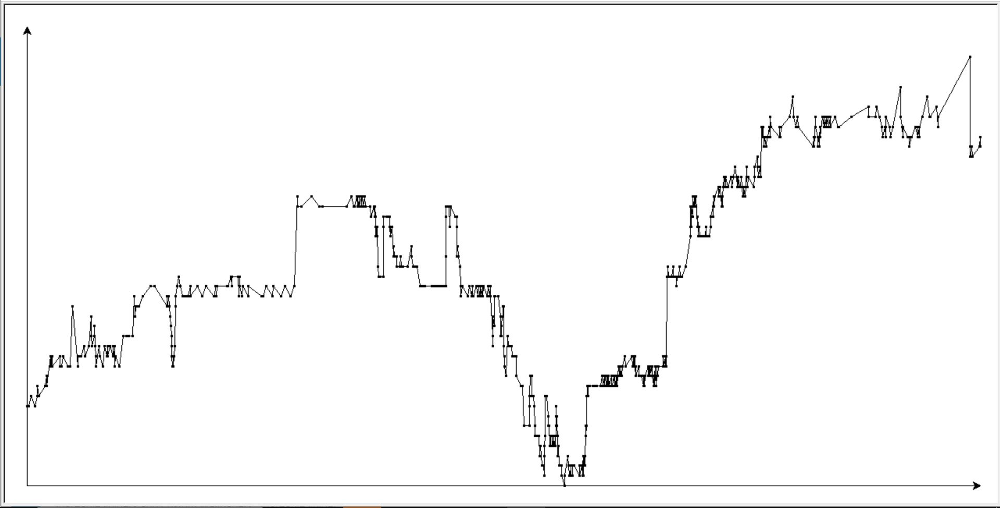 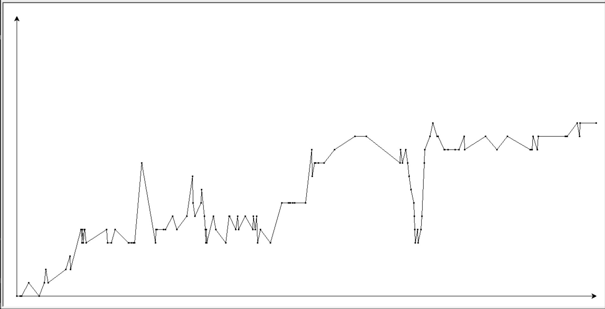 

Price chart:

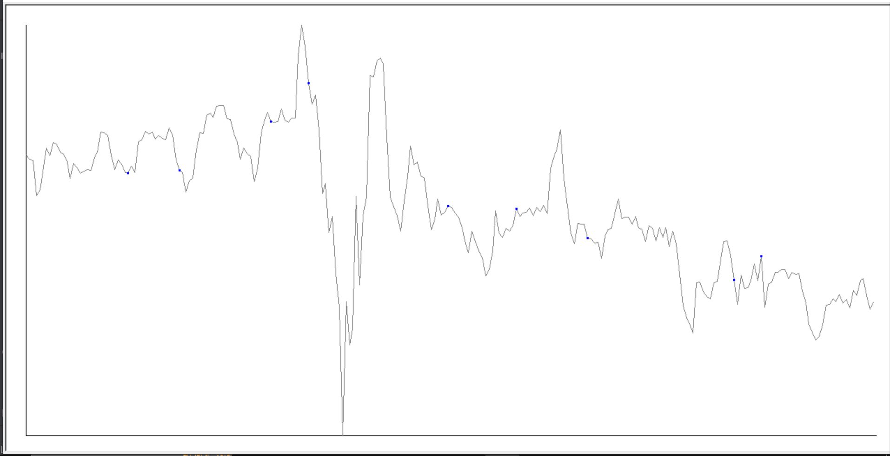 

Market Profile charts:

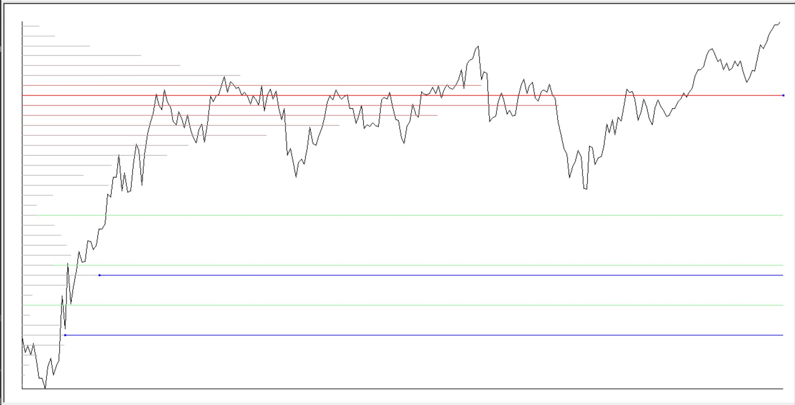 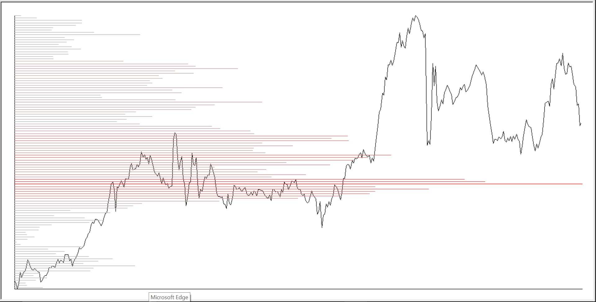 

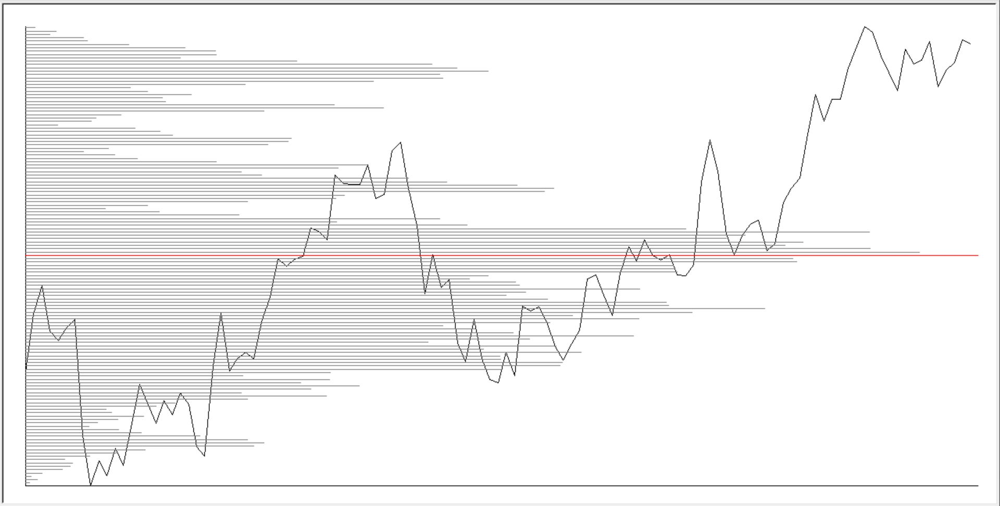 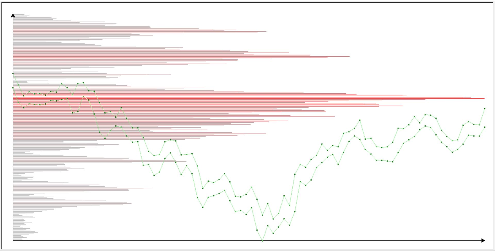 

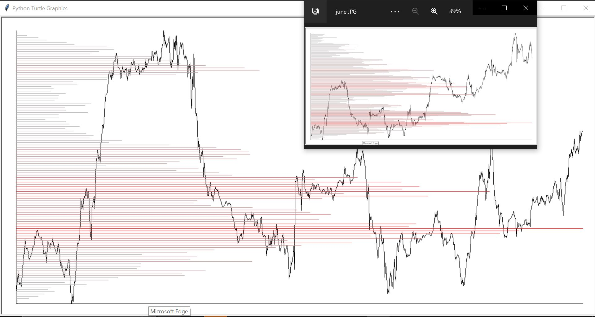 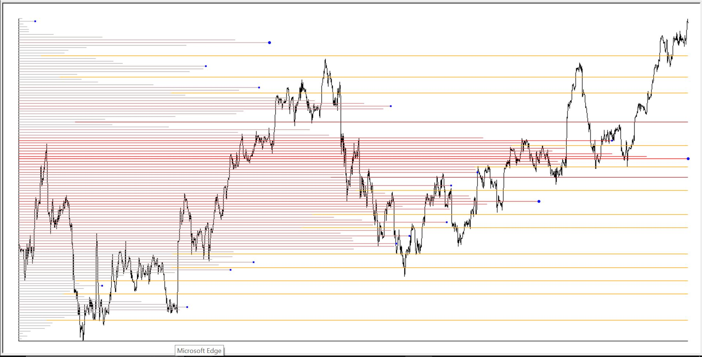 

Volume charts:

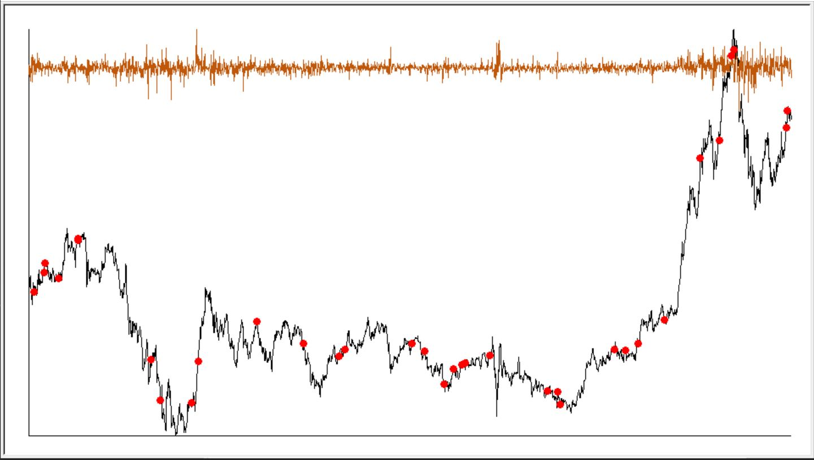 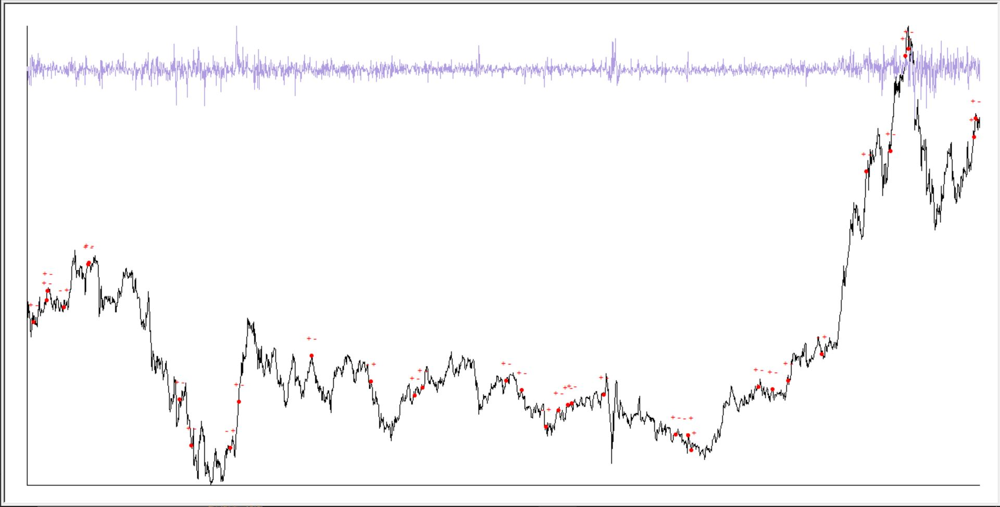 

BackTest Info charts:

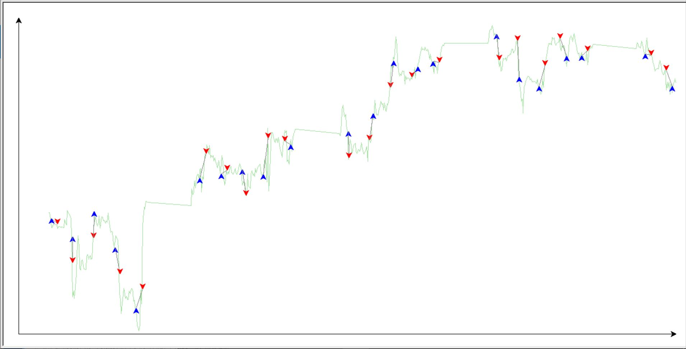 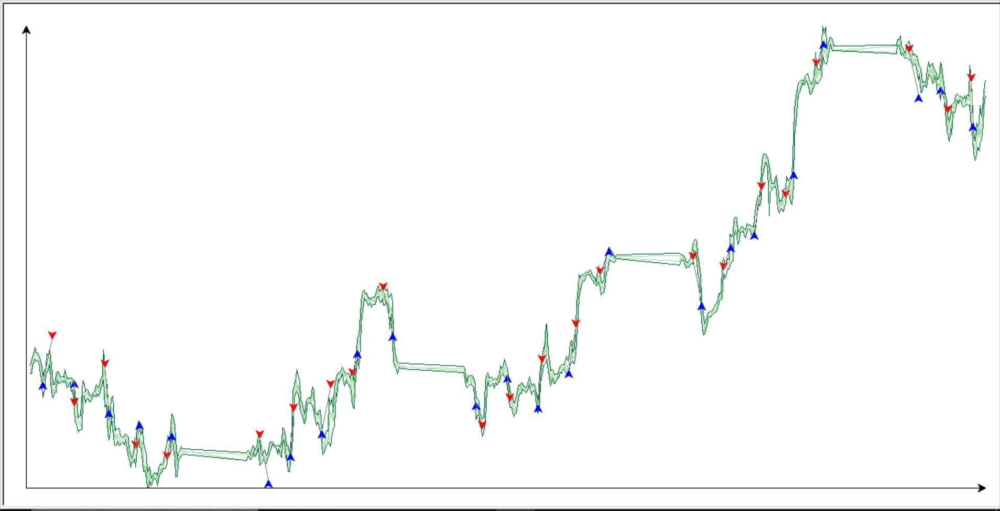

Future Comparison:

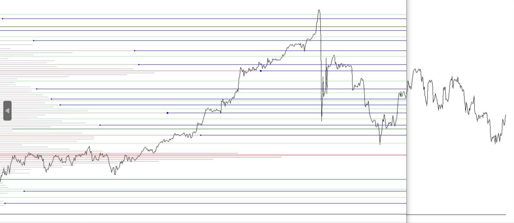

in addition, it gives backtest report like this:

Orders Report-------------------------------------------------------------------- 
20 Orders were opened,  
20 of them were closed. 
 
Sell Order: 
   Open time: 2023-02-01 13:00:00 
   Close time: 2023-02-01 20:00:00 
   Price: 1.2319 
   TP: 1.2269 
   SL: 1.2349 
   Profit: -0.0024 
   Success: False 
   Open: False 
 
. 
. 
. 
 
Buy Order: 
   Open time: 2023-02-28 13:00:00 
   Close time: 2023-02-28 13:55:43 
   Price: 1.2036 
   TP: 1.2086 
   SL: 1.2006 
   Profit: 0.005 
   Success: True 
   Open: False 
 
Success: %50.0 
Profit: 106 pip 
Total execution time: 121 Sec. 
